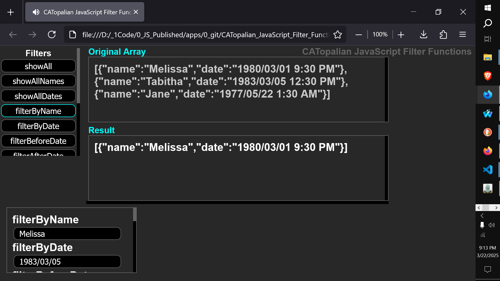

# CATopalian JavaScript Filter Functions
A JavaScript application that teaches how to filter data in many ways.  

USE APP: https://christopherandrewtopalian.github.io/CATopalian_JavaScript_Filter_Functions/CATopalian_JavaScript_Filter_Functions.html  

---

### How to Download this App
1. Click the green Code Button on this github page
2. Choose Download ZIP
3. Save the Zip File
4. Extract All
5. Double click the HTML file to start the App

---

Happy Scripting :-)

